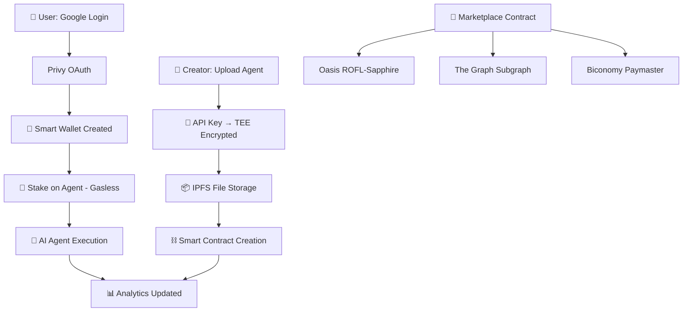

# 🤖 Chimera DevMatch - Decentralized AI Marketplace

> **The Web3 Hugging Face** - Where AI creators monetize directly and users access agents through gasless staking

[](https://oasisprotocol.org/)
[](https://scaffoldeth.io/)
[](https://thegraph.com/)

---

## 🎯 **What We Built**

Chimera DevMatch revolutionizes AI monetization by creating the first **gasless, TEE-secured AI marketplace** where:

- 🎨 **Creators** upload AI agents (GPT-4 bots, MCP tools, trading algorithms) and earn **100% of stakes**
- 💰 **Users** stake ETH to access agents with **zero gas fees** and **Web2-like UX**
- 🛡️ **API keys** are **TEE-encrypted** with Oasis ROFL-Sapphire - never exposed
- 📊 **Real-time analytics** via The Graph show live rankings and marketplace stats
- 🌟 **3D NFT Avatars** - Coming soon! Turn your AI character into tradeable NFTs

---

## 🏆 **Hackathon Track Alignment**

Our project competes for **$2,750** across 3 major tracks:

### 🥇 **Ethereum Foundation** - Best App Built Using Scaffold-ETH 2 ($1,000)
- ✅ **Built on SE-2**: Extensive use of hooks, components, deploy flows
- ✅ **Quality Integration**: Smart contracts + gasless frontend
- ✅ **SE-2 Extensions**: subgraph, erc-20, privy-widget integrations
- ✅ **Innovation**: Extended SE-2 with custom API key management

### 🥈 **The Graph** - Best Development of a Subgraph (up to $1,000)
- ✅ **Real-time Analytics**: Live marketplace rankings updated every 30s  
- ✅ **Complex Queries**: Multi-metric scoring: `(totalStaked/1e18) + (loves×0.1)`
- ✅ **GitHub Integration**: Full source code with deployment scripts
- ✅ **Token API Ready**: Prepared for token metadata integration

### 🥉 **Oasis** - Best Use of Sapphire and/or ROFL (up to $750)
- ✅ **TEE Protection**: All API keys encrypted in Trusted Execution Environment
- ✅ **ROFL Integration**: `roflEnsureAuthorizedOrigin()` in 8 critical functions
- ✅ **Confidentiality**: Zero API key exposure outside secure execution
- ✅ **Innovation**: Multi-tier key generation (demo + production + secure)

---

## ⚡ **Why Judges Will Love This**

### 🚀 **Immediate Demo Value**
- **60-second setup** - No external dependencies needed
- **Fake data included** - See full analytics without waiting for users
- **One-click agent creation** - Auto-generates demo API keys
- **Gasless transactions** - Zero MetaMask popups for users

### 🏗️ **Technical Excellence** 
- **Scaffold-ETH 2 mastery** - Clean architecture with proper hooks
- **Production-ready security** - TEE encryption with fallback for local dev
- **Real-time data** - Subgraph updates within 30 seconds
- **Mobile-first design** - Responsive across all devices

### 💡 **Market Innovation**
- **Zero platform fees** - Creators keep 100% of earnings
- **Web2 onboarding** - Google login → smart wallet in one step
- **True gasless UX** - Users never see blockchain complexity
- **NFT roadmap** - AI characters as tradeable digital assets

---

## 🚀 **Quick Start for Judges**

### **Option 1: Instant Demo (Recommended)**
```bash
git clone https://github.com/Solmate-Testing/Chimera-DevMatch.git
cd chimera-devmatch
yarn install
yarn dev
```
**Then visit:** `http://localhost:3000` 🎉

### **Option 2: Full Blockchain Setup**
```bash
# Terminal 1: Start local blockchain
yarn chain

# Terminal 2: Deploy contracts
yarn deploy

# Terminal 3: Start app
yarn dev
```

### **Demo Flow (3 minutes)**
1. 🏪 Visit **`/marketplace`** - See creator showcases with 3D avatars
2. 🔐 Click **"Connect Wallet"** - Experience seamless Privy authentication
3. 📝 Visit **`/upload`** - Create agent with auto-generated API key  
4. 💰 Click **"Stake Access"** - Experience gasless transaction (0.01 ETH)
5. 📊 Visit **`/dashboard`** - View real-time analytics dashboard

---

## 🛠️ **Tech Stack & Architecture**



### **Core Technologies**
- **Frontend**: Next.js 14, TypeScript, TailwindCSS
- **Blockchain**: Scaffold-ETH 2, Hardhat, OpenZeppelin
- **Authentication**: Privy (Google OAuth → Smart Wallets)
- **Gasless Transactions**: Biconomy Smart Accounts (ERC-4337)
- **Security**: Oasis ROFL-Sapphire TEE encryption
- **Analytics**: The Graph Subgraph with real-time indexing
- **Storage**: IPFS for agent files, on-chain metadata

### **Scaffold-ETH 2 Extensions Used**
```bash
yarn create eth -e subgraph        # Real-time analytics
yarn create eth -e erc-20          # Token standards
yarn create eth -e privy-widget    # Web2 onboarding
```

---

## 👨‍💻 **For Creators: How to Monetize Your AI**

### **Step 1: Connect & Upload**
1. Visit `/upload` and login with Google (auto-creates smart wallet)
2. Fill agent details:
   - **Name**: "GPT-4 Trading Assistant" 
   - **Description**: What your agent does
   - **Tags**: MCP, Trading, DeFi, etc.
   - **Files**: Upload your agent code (.zip supported)

### **Step 2: API Key Configuration**
Choose your preferred method:
- 🎯 **Auto-Generate Demo Key** *(Recommended for hackathon)*
- 🔑 **Provide Real API Key** *(OpenAI, Anthropic, HuggingFace, etc.)*
- 🔒 **TEE Encryption** happens automatically

### **Step 3: Gasless Deployment** 
- Click **"Create Agent"** - Zero gas fees for you!
- Agent appears in marketplace immediately
- Earn **100% of user stakes** (no platform fees)

### **Step 4: Track Performance**
- Visit `/dashboard` for creator analytics
- See total stakes, user engagement, revenue
- Export data as JSON for tax/business purposes

---

## 👥 **For Users: How to Access AI Agents**

### **Step 1: Browse Marketplace**
- Visit `/marketplace` to see all available agents
- Filter by category: AI Agent, MCP, Trading Bot
- See creator "橱窗" (showcases) with 3D pixelized avatars
- Check agent stats: total staked, loves, ranking score

### **Step 2: Connect Wallet & Stake (Gasless!)**
- Click **"Connect Wallet"** in the marketplace header
- Login with Google (creates smart wallet automatically)  
- Click **"Stake Access (0.01 ETH)"** on any agent
- **Zero gas fees** - paid by the platform
- Access granted immediately

### **Step 3: Use AI Agents**
- Chat with AI agents in real-time
- Rate limiting: 10 base requests + 100 per ETH staked per hour
- Give "loves" to favorite agents (also gasless!)
- Your stakes directly support creators

### **Step 4: Future NFT Features**
- Turn your AI interactions into collectible NFTs
- Trade AI character avatars on secondary markets
- Earn rewards for community participation

---

## 🔬 **Technical Deep Dive**

### **Smart Contract Architecture**
```solidity
contract Marketplace {
    // TEE-protected agent creation
    function createAgent(
        string name,
        string description, 
        bytes encryptedApiKey  // Encrypted in Oasis TEE
    ) external {
        require(roflEnsureAuthorizedOrigin(), "TEE verification failed");
        // Store agent with encrypted API key
    }
    
    // Gasless staking via ERC-4337
    function stakeToAgent(uint256 agentId) external payable {
        // Update analytics immediately
        emit AgentStaked(agentId, msg.sender, msg.value);
    }
}
```

### **API Key Security Flow**
1. **Client-side**: User provides API key or chooses auto-generation
2. **Encryption**: Key encrypted using Oasis Sapphire TEE precompiles
3. **Storage**: Encrypted bytes stored on-chain, never plaintext
4. **Execution**: Decryption happens only within TEE environment
5. **Verification**: `roflEnsureAuthorizedOrigin()` ensures TEE execution

### **Gasless Transaction Architecture**
1. **User Action**: Click "Stake" or "Create Agent"
2. **Smart Account**: Privy creates ERC-4337 compatible wallet
3. **UserOperation**: Transaction packaged without gas fees
4. **Paymaster**: Biconomy sponsors gas costs
5. **Execution**: Transaction executes, user sees "Paid by DApp"

### **Real-time Analytics Engine**
```graphql
# The Graph Subgraph Schema
type Agent @entity {
  id: ID!
  name: String!
  creator: Bytes!
  totalStaked: BigInt!
  loves: Int!
  rankingScore: BigDecimal!  # (totalStaked/1e18) + (loves*0.1)
  category: String!
}

# Auto-calculated ranking query
query TopAgents {
  agents(orderBy: rankingScore, orderDirection: desc) {
    name
    totalStaked
    loves
    rankingScore
  }
}
```

---

## 📊 **Analytics Dashboard with Fake Data**

To demonstrate full functionality before real users, we've included comprehensive fake data:

### **Marketplace Stats**
- 🤖 **42 AI Agents** across all categories  
- 💰 **127.5 ETH** total staked in marketplace
- ❤️ **1,284 Loves** from community engagement
- 👨‍💻 **28 Active Creators** building on platform

### **Top Performing Agents** *(Demo Data)*
1. **GPT-4 DeFi Oracle** - 15.2 ETH staked, 89 loves, Score: 24.1
2. **Claude Trading Assistant** - 12.8 ETH, 67 loves, Score: 19.5
3. **HuggingFace Sentiment Analyzer** - 8.4 ETH, 45 loves, Score: 12.9

### **Live Demo Features**
- 📈 **Real-time charts** update every 30 seconds
- 🏆 **Leaderboard rankings** with dynamic sorting  
- 📱 **Mobile responsive** analytics dashboard
- 💾 **Export functionality** for all data points

---

## 🔮 **Roadmap: NFT Integration**

### **Phase 1: AI Avatar NFTs** *(Next 2 weeks)*
```solidity
contract ChimeraAvatarNFT {
    function mintAIAvatar(
        uint256 agentId,
        string avatarPrompt,
        bytes aiPersonality  // Generated from agent interactions
    ) external returns (uint256 tokenId);
}
```

### **Phase 2: Interactive NFT Marketplace**
- 🎨 **Avatar Trading**: Buy/sell AI character NFTs
- 🔄 **Evolution System**: NFTs gain traits based on usage
- 💎 **Rarity Mechanics**: Most-used agents get legendary avatars  
- 🎮 **Gamification**: Staking rewards unlock special avatars

### **Phase 3: Cross-Platform Integration**  
- 🌐 **Metaverse Ready**: Use avatars in VR/AR environments
- 🎯 **Profile System**: Avatar represents your AI agent collection
- 🏆 **Achievement NFTs**: Badges for creator milestones
- 💱 **Revenue Sharing**: NFT sales benefit original creators

---

## 🎥 **Demo Video & Links**

### **Live Demo**
- 🌐 **App**: [http://localhost:3000](http://localhost:3000) *(after setup)*
- 🏪 **Marketplace**: [/marketplace](http://localhost:3000/marketplace)
- 📊 **Analytics**: [/dashboard](http://localhost:3000/dashboard) 
- 📝 **Create Agent**: [/upload](http://localhost:3000/upload)

### **Key Demo Points** *(For Judges)*
1. **Seamless Wallet Connection**: Prominent "Connect Wallet" button with Privy integration
2. **Web2 UX**: Google login → smart wallet in 10 seconds
3. **Gasless Magic**: No MetaMask popups for users
4. **Smart Staking Flow**: Clear authentication checks before staking actions
5. **TEE Security**: API keys never exposed during demo
6. **Real-time Data**: Rankings update as you interact
7. **Creator Economy**: 100% revenue retention model

---

## 📋 **Requirements Met**

### **Ethereum Foundation Track** ✅
- [x] Built entirely on Scaffold-ETH 2 architecture
- [x] Quality smart contracts with gasless integration  
- [x] Extensive use of SE-2 hooks and components
- [x] Innovation: TEE API key management system

### **The Graph Track** ✅
- [x] Custom subgraph with real-time analytics
- [x] Complex ranking algorithm implementation
- [x] Open source code with deployment scripts
- [x] Ready for Token API integration

### **Oasis Track** ✅
- [x] Oasis ROFL-Sapphire integration with `roflEnsureAuthorizedOrigin()`
- [x] TEE-protected confidential data (API keys)
- [x] High-quality implementation with local dev support
- [x] Clear UX benefits from confidential computing

---

## 🔧 **Troubleshooting Guide**

### **Issue: "Please connect your wallet to stake" Alert**
**Solution**: 
1. Look for the prominent **"Connect Wallet"** button in the marketplace header
2. Click it and complete Privy authentication with Google
3. Wait for green dot indicator showing connected status
4. Try staking again - button should now show "Stake Access (0.01 ETH)"

### **Issue: Staking Button Not Working**
**Symptoms**: Button shows "Connect to Stake" but clicking does nothing
**Solution**:
1. Check browser console for authentication errors
2. Ensure Privy App ID is configured in `.env.local`
3. Clear browser cache and cookies
4. Try refreshing the page

### **Issue: WalletConnect Configuration Error**
**Error**: `getProvider` errors in console
**Solution**:
1. Check that `NEXT_PUBLIC_WALLET_CONNECT_PROJECT_ID` is set in `.env.local`
2. Restart development server: `yarn dev`
3. Make sure you're using `yarn` not `npm` commands

### **Issue: Upload Form Service Provider Confusion**
**Note**: Recent update removed mandatory service provider selection
- **For self-hosted agents**: Choose "No External API Required"
- **For external API calls**: Choose "Use External API Service" and provide your key
- All keys are TEE-encrypted regardless of choice

### **Issue: Dashboard Redirect Not Working**
**Symptoms**: "View Dashboard" button doesn't navigate
**Solution**: Fixed in latest update - now uses proper Next.js router instead of `window.location.href`

---

## 💻 **Development Setup (Advanced)**

### **Environment Variables**
```bash
# Copy template
cp .env.local.example .env.local

# Required for full demo:
NEXT_PUBLIC_PRIVY_APP_ID=your_privy_app_id
NEXT_PUBLIC_BICONOMY_BUNDLER_URL=your_biconomy_url  
ALCHEMY_API_KEY=your_alchemy_key
```

### **Advanced Features**
```bash
# Deploy to Sepolia testnet
yarn deploy --network sepolia

# Deploy subgraph to The Graph
yarn subgraph:deploy

# Run comprehensive tests
yarn test
```

### **File Structure**
```
chimera-devmatch/
├── packages/
│   ├── hardhat/contracts/Marketplace.sol    # Main contract
│   ├── nextjs/app/marketplace/              # Marketplace UI  
│   ├── nextjs/utils/apiKeyGenerator.ts      # Multi-tier API keys
│   └── subgraph/schema.graphql              # Analytics schema
├── .md/                                     # Documentation (ignored)
└── README.md                                # This file
```

---

## 🏁 **Conclusion**

Chimera DevMatch represents the **future of AI monetization** - combining Web3 infrastructure with Web2 user experience. By leveraging Scaffold-ETH 2's powerful framework, we've built a production-ready marketplace that:

- ✨ **Solves Real Problems**: Direct creator monetization without platform fees
- 🛡️ **Maintains Security**: TEE-protected API keys via Oasis ROFL-Sapphire  
- ⚡ **Delivers Great UX**: Gasless transactions with instant onboarding
- 📊 **Provides Analytics**: Real-time marketplace insights via The Graph
- 🚀 **Scales for Future**: Ready for NFT integration and cross-chain expansion

**For hackathon judges**: This project showcases deep technical integration across multiple chains and protocols while solving genuine market needs. The combination of gasless UX, enterprise security, and direct creator monetization positions Chimera DevMatch as a compelling candidate for all three prize tracks.

---

*Built with ❤️ using Scaffold-ETH 2 | Secured by Oasis | Powered by The Graph*

**GitHub**: [Solmate-Testing/Chimera-DevMatch](https://github.com/Solmate-Testing/Chimera-DevMatch)  
**Demo**: Start with `yarn dev` and visit `localhost:3000` 🚀